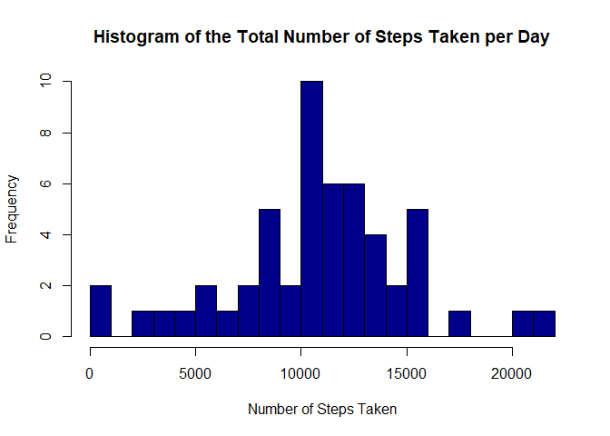
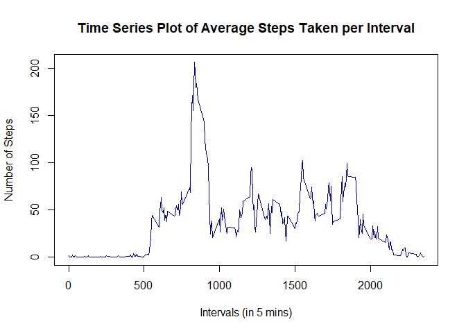
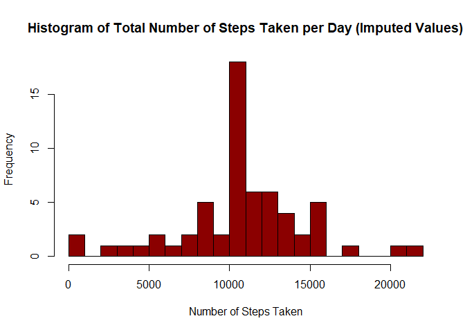
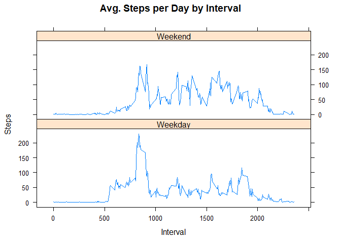

## Loading and preprocessing the data

```r
if(!file.exists("activity.zip")) {
  download.file("https://d396qusza40orc.cloudfront.net/repdata%2Fdata%2Factivity.zip", "activity.zip")
}
unzip("activity.zip")
activity <- read.csv("activity.csv", sep = ",")
```

## What is mean total number of steps taken per day?

```r
data <- activity[!(is.na(activity$steps)), ]
```

TO calculate the total number of steps taken per day, the data needs to be grouped using aggregate function based on

```r
totalStepsPerDay <- aggregate(steps ~ date, data, sum)
head(totalStepsPerDay)
```

```
##         date steps
## 1 2012-10-02   126
## 2 2012-10-03 11352
## 3 2012-10-04 12116
## 4 2012-10-05 13294
## 5 2012-10-06 15420
## 6 2012-10-07 11015
```

Create a histogram of the total number of steps taken each day.

```r
hist(totalStepsPerDay$steps, breaks=20, xlab="Number of Steps Taken", 
     main="Histogram of the Total Number of Steps Taken per Day",
     col="darkblue")
```

<!-- -->

Summary

```r
library(dplyr)
totalStepsPerDay_Summary <- summarise(totalStepsPerDay, meanOfTotalSteps=mean(totalStepsPerDay$steps),
                               medianOfTotalSteps=median(totalStepsPerDay$steps))
print(totalStepsPerDay_Summary)
```

```
##   meanOfTotalSteps medianOfTotalSteps
## 1         10766.19              10765
```
Based on the result, the mean of the total number of steps taken per day is **10766.19** and the median value is **10765**.


## What is the average daily activity pattern?


```r
meanStepsPerInterval <- aggregate(steps ~ interval, data, mean)
head(meanStepsPerInterval)
```

```
##   interval     steps
## 1        0 1.7169811
## 2        5 0.3396226
## 3       10 0.1320755
## 4       15 0.1509434
## 5       20 0.0754717
## 6       25 2.0943396
```

Make a time series plot (i.e. \color{red}{\verb|type = "l"|}type = "l") of the 5-minute interval (x-axis) and the average number of steps taken, averaged across all days (y-axis)

```r
plot(x=meanStepsPerInterval$interval, y=meanStepsPerInterval$steps, type="l",
     main="Time Series Plot of Average Steps Taken per Interval",
     ylab="Number of Steps", xlab="Intervals (in 5 mins)",
     col="darkblue", lwd=1.5)
```

<!-- -->

The second question is to find maximum number of steps on average across all the days in the dataset in 5 minutes interval

```r
meanStepsPerInterval[grep(max(meanStepsPerInterval$steps), meanStepsPerInterval$steps), ]
```

```
##     interval    steps
## 104      835 206.1698
```
So the interval with the maximum number of steps is interval **835**.


## Imputing missing values
Missing values were imputed with the average values for each intervals.

```r
imputedData <- activity
for(x in 1:17568) {
    if(is.na(imputedData[x, 1])==TRUE) {
        imputedData[x, 1] <- meanStepsPerInterval[meanStepsPerInterval$interval %in% imputedData[x, 3], 2]
    }
}
head(imputedData)
```

```
##       steps       date interval
## 1 1.7169811 2012-10-01        0
## 2 0.3396226 2012-10-01        5
## 3 0.1320755 2012-10-01       10
## 4 0.1509434 2012-10-01       15
## 5 0.0754717 2012-10-01       20
## 6 2.0943396 2012-10-01       25
```

Create a histogram after the data has been imputed

```r
imputedTotalStepsPerDay <- aggregate(steps ~ date, imputedData, sum)
head(imputedTotalStepsPerDay)
```

```
##         date    steps
## 1 2012-10-01 10766.19
## 2 2012-10-02   126.00
## 3 2012-10-03 11352.00
## 4 2012-10-04 12116.00
## 5 2012-10-05 13294.00
## 6 2012-10-06 15420.00
```

```r
hist(imputedTotalStepsPerDay$steps, breaks=20, xlab="Number of Steps Taken", 
     main="Histogram of Total Number of Steps Taken per Day (Imputed Values)",
     col="darkred")
```

<!-- -->

```r
hist(totalStepsPerDay$steps, breaks=20, xlab="Number of Steps Taken", 
     main="Histogram of the Total Number of Steps Taken per Day",
     col="darkblue")
```

<!-- -->

Calculate the mean and median of imputed data.

```r
imputedStepsSummary <- summarise(imputedTotalStepsPerDay, 
                                 meanOfTotalSteps=mean(imputedTotalStepsPerDay$steps), 
                                 medianOfTotalSteps=median(imputedTotalStepsPerDay$steps))  
print(imputedStepsSummary)
```

```
##   meanOfTotalSteps medianOfTotalSteps
## 1         10766.19           10766.19
```

Print the mean and median of initial data (before the data has been imputed)

```r
print(totalStepsPerDay_Summary)
```

```
##   meanOfTotalSteps medianOfTotalSteps
## 1         10766.19              10765
```
The mean values are the same, at **10766.19** steps. On the other hand, the median value is a bit larger than before, it is **10766.19** steps.


## Are there differences in activity patterns between weekdays and weekends?
Create a new factor variable in the dataset with two levels – “weekday” and “weekend” indicating whether a given date is a weekday or weekend day. There is a higher peak earlier on weekdays, and more overall activity on weekends.


```r
weekdays <- c("Monday", "Tuesday", "Wednesday", "Thursday", 
              "Friday" )
imputedData$dow = as.factor(ifelse(is.element(weekdays(as.Date(imputedData$date)),weekdays), "Weekday", "Weekend"))
steps_by_interval_i <- aggregate(steps ~ interval + dow, imputedData, mean)
library(lattice)
xyplot(steps_by_interval_i$steps ~ steps_by_interval_i$interval|steps_by_interval_i$dow, main="Avg. Steps per Day by Interval",xlab="Interval", ylab="Steps",layout=c(1,2), type="l") 
```

<!-- -->
